# eclipse程序安装说明

* 
* 1.双击打开文件
* 
* 2.选择Java EE
* 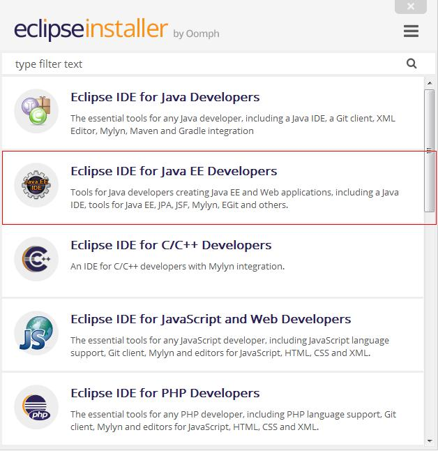
* 3.选择安装地址，并联网下载
* 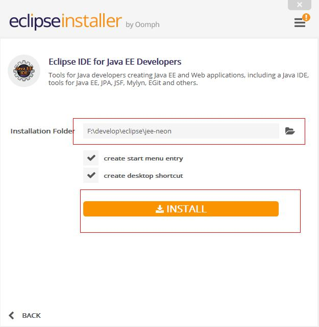
* 4.下载进行中
* 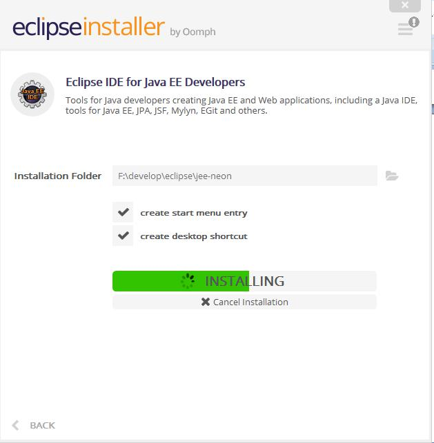
* 5.下载进行中，勾选，同意
* 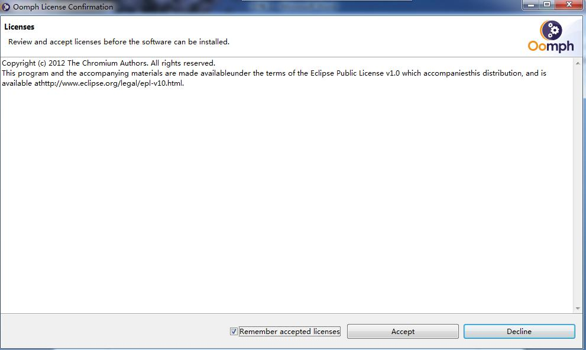
* 6.下载进行中
* 
* 7.下载完成，点击LAUNCH
* 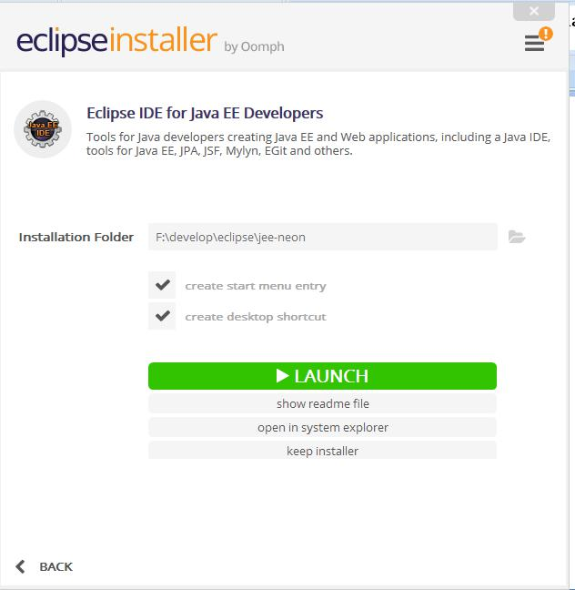
* 8.程序打开中
* 
* 9.选择workspace，空间应大
* 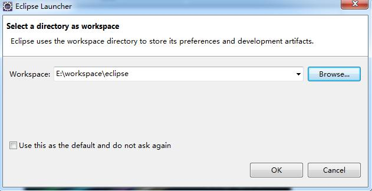
* 10.至此，Eclipse软件安装完成。下面的是新建project步骤
* 
* 11.关闭Welcome
* 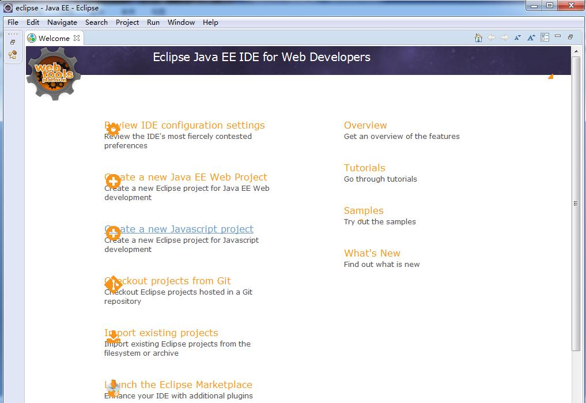
* 12.关闭Welcome
* 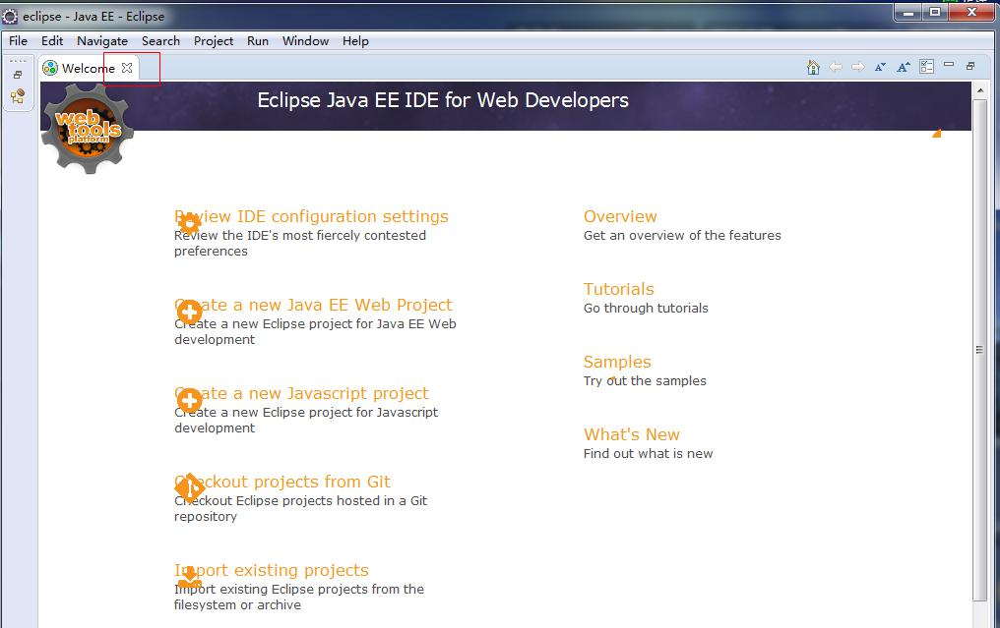
* 13.关闭后出现图示
* 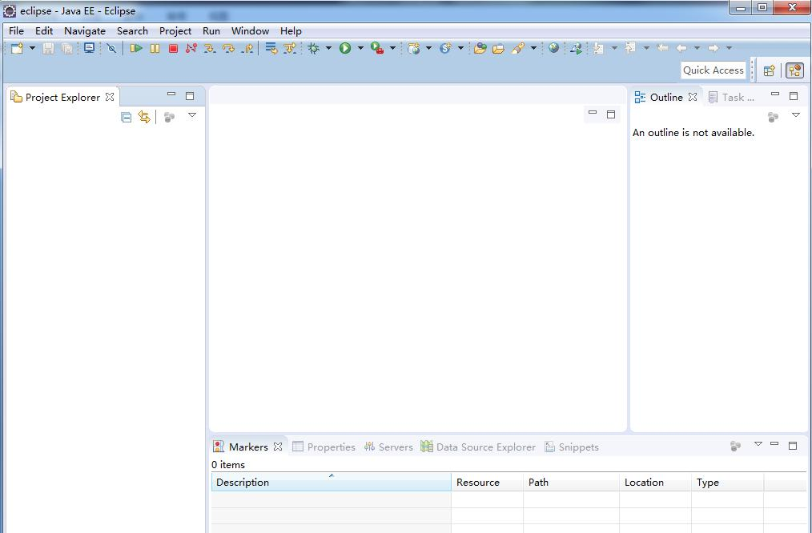
* 14.在该图位置右键，选择new,project
* 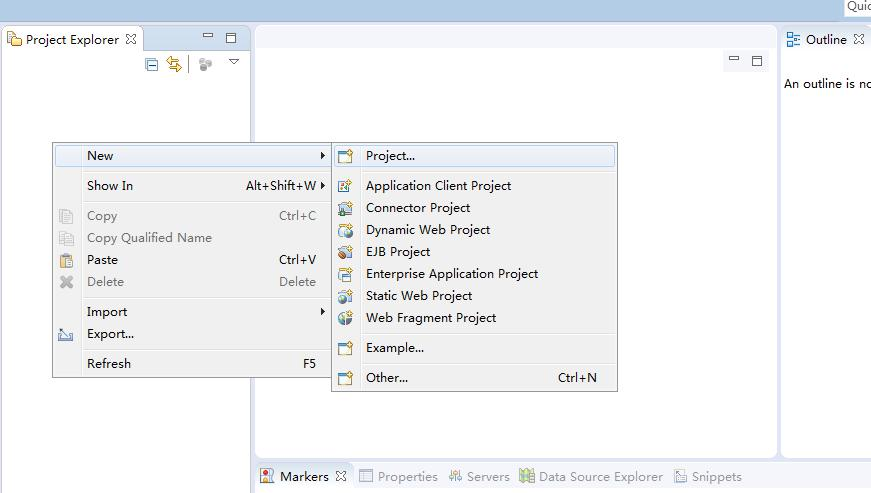
* 15.选择Java Project
* 
* 16.输入项目名称，选择JRE
* 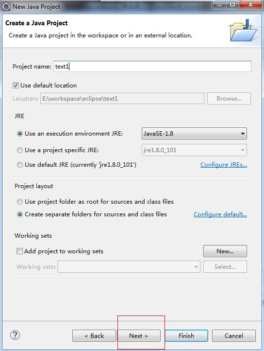
* 17.点击Finish键
* 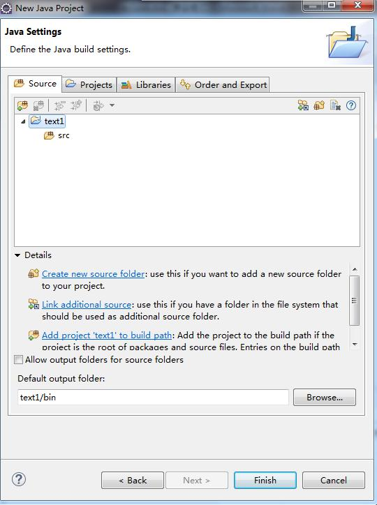
* 18.YES
* 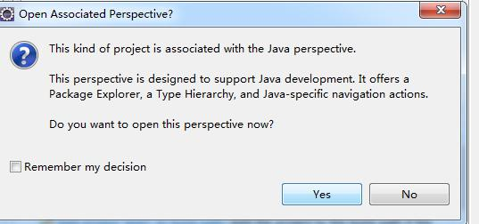
* 19在src上右键，新建Class文件
* 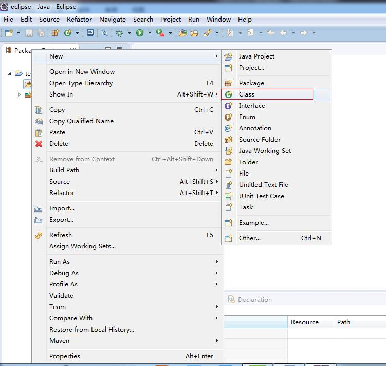
* 20.输入程序名
* 
* 21.项目新建完成
* 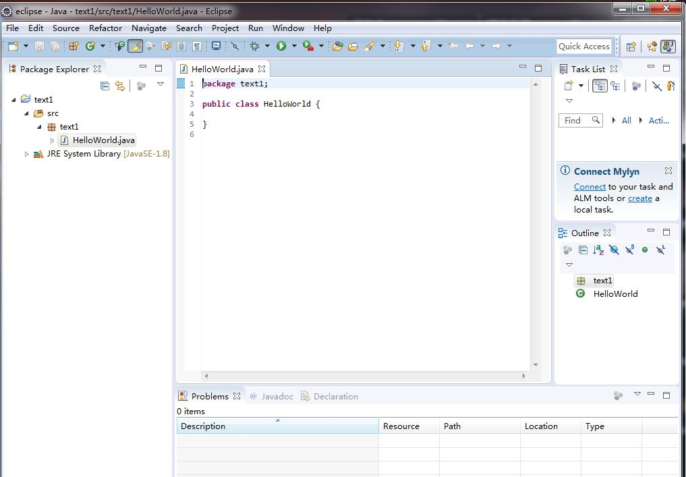