# MySQL安装

=================================

* MySQL安装
  * 1.打开
  * 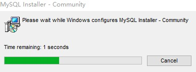
  * 2.aggrement
  * 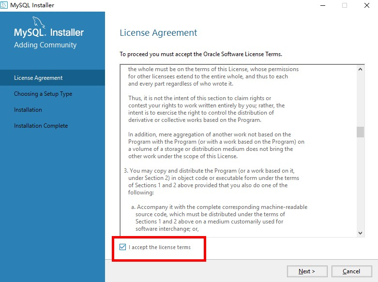
  * 3.type ---custom
  * 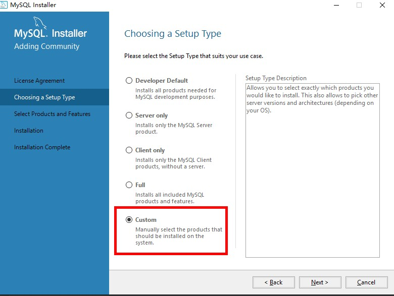
  * 4.选择 products
  * 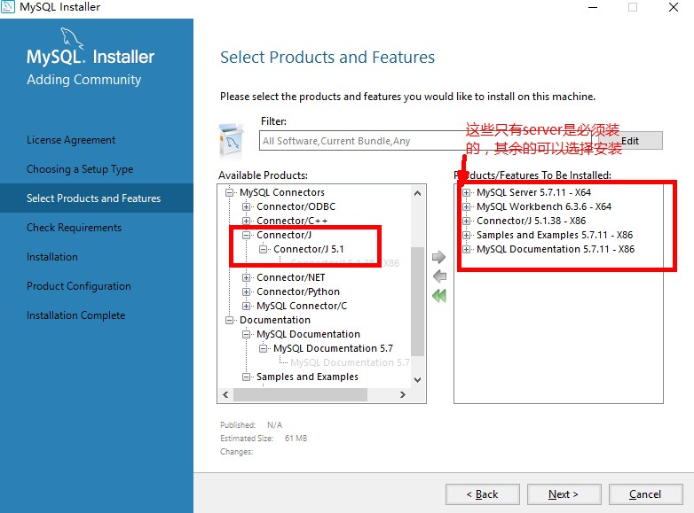
  * 5.Execute --- next
  * 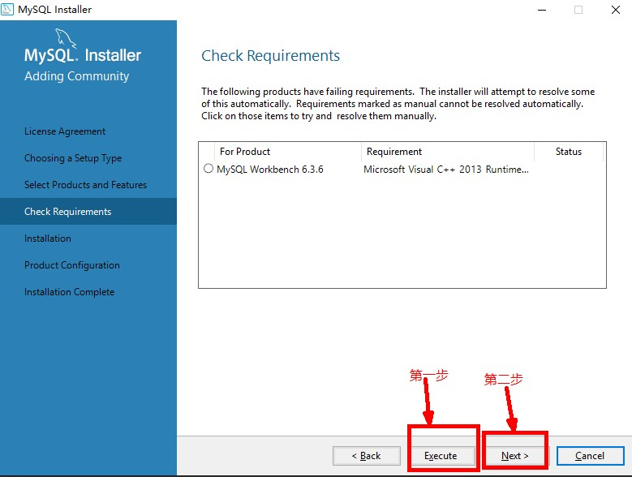
  * 6.check
  * 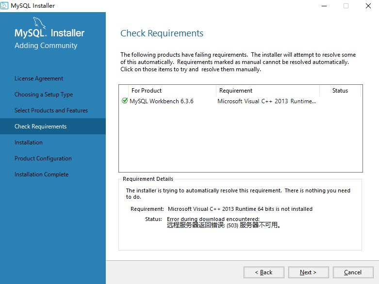
  * 7.installation ---- Execute
  * 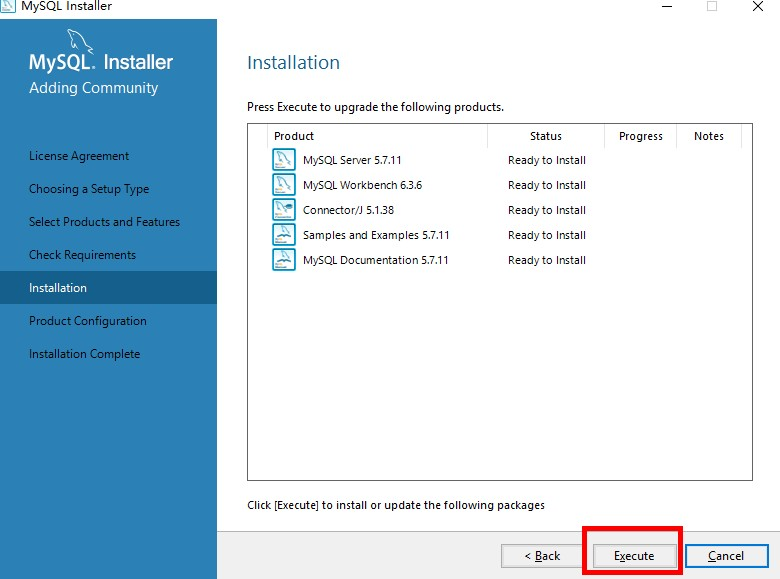
  * 8.installation
  * 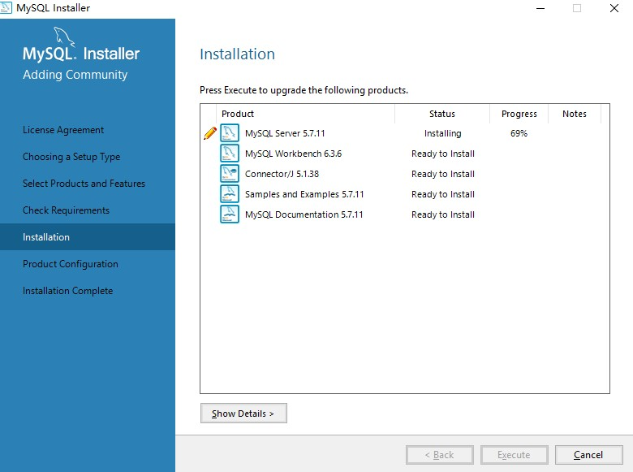
  * 9.
  * 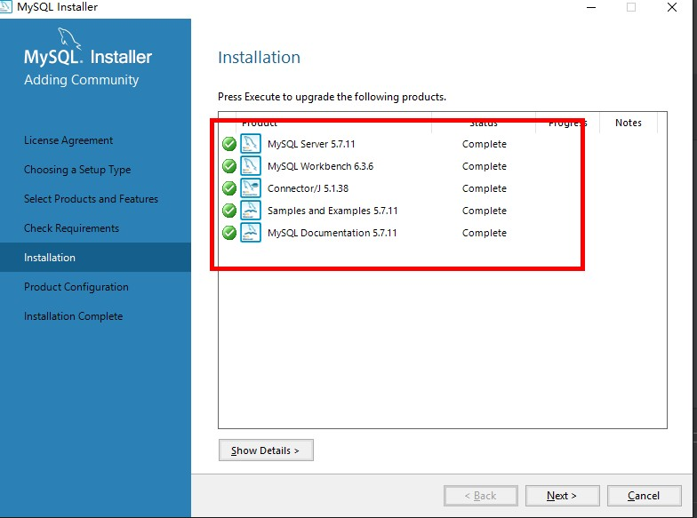
  * 10.produvt configuration
  * 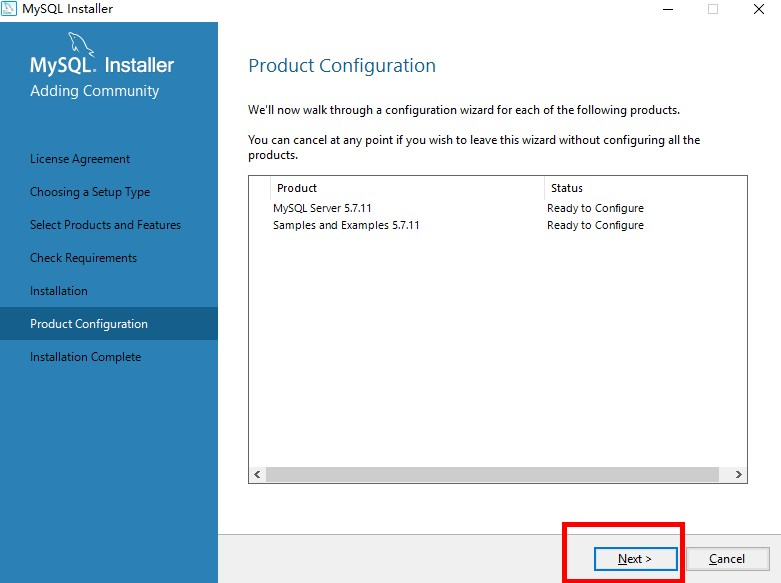
  * 11.type
  * 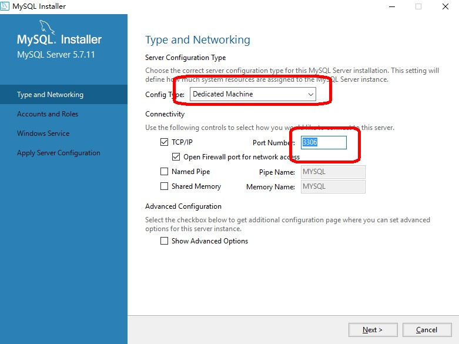
  * 12.root password
  * 
  * 13.service
  * 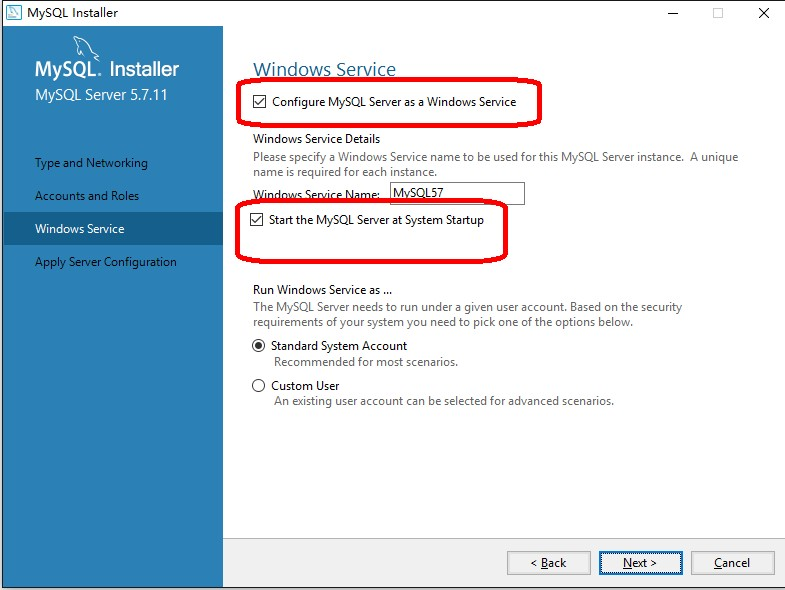
  * 14.
  * 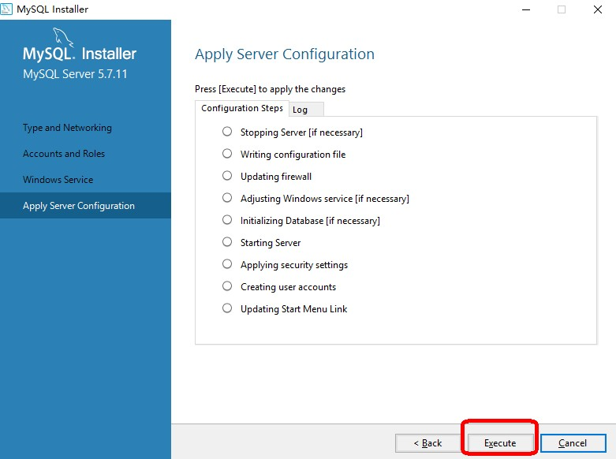
  * 15.
  * 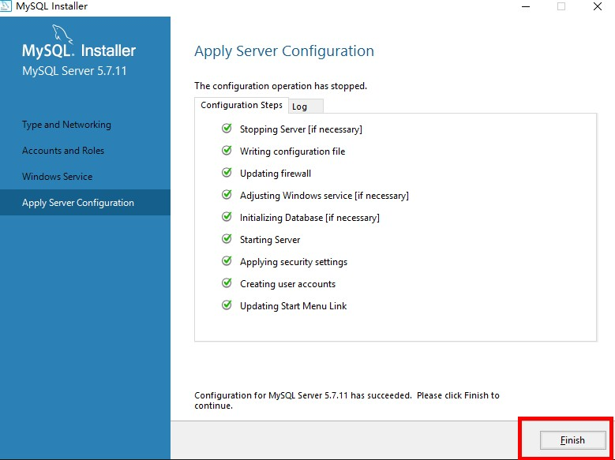
  * 16.
  * 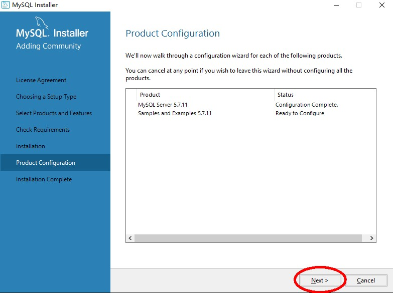
  * 17.check user,password
  * 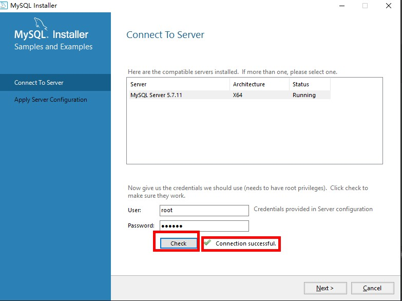
  * 18.
  * 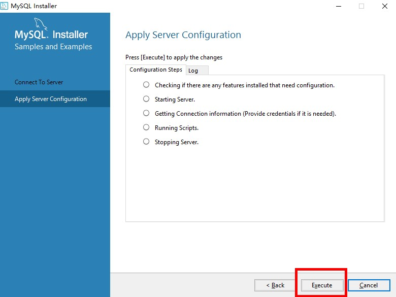
  * 19.
  * 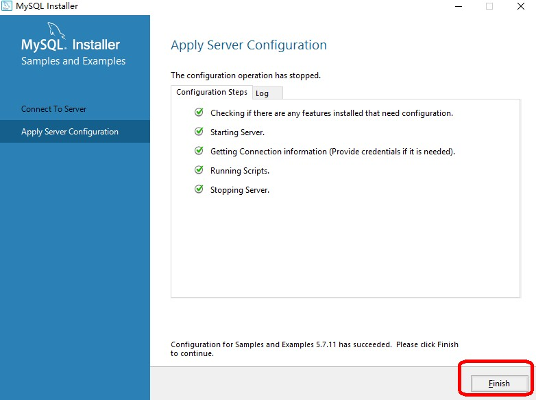
  * 20.
  * 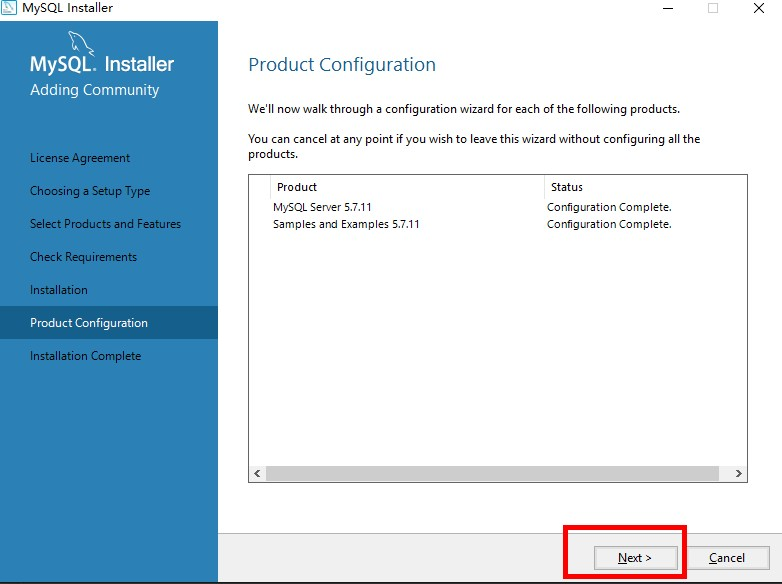
  * 21.finish
  * 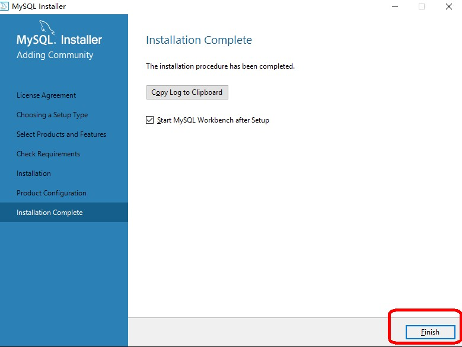