# genymotion安装文档

* 1.打开文件，安装
* 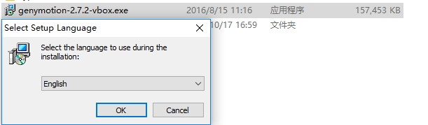
* 2.选择安装目录
* 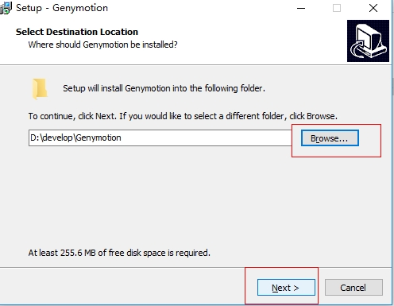
* 3.
* 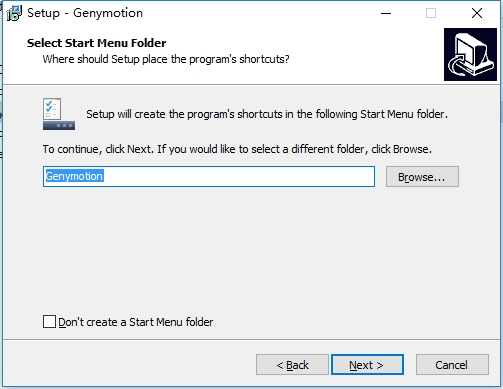
* 4.
* 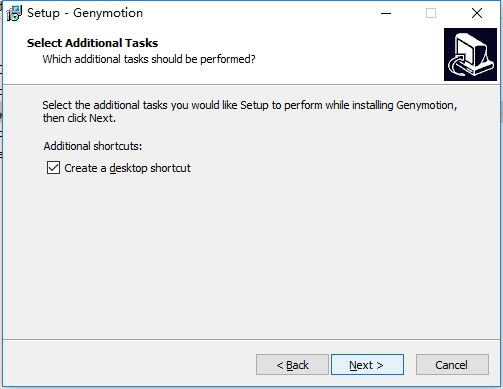
* 5.
* 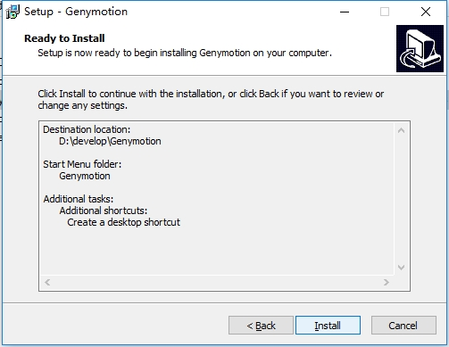
* 6.打开文件，安装
* 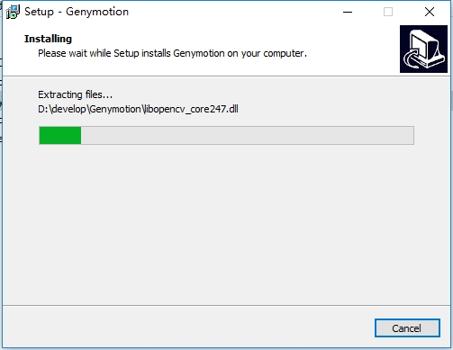
* 7.选择安装目录
* 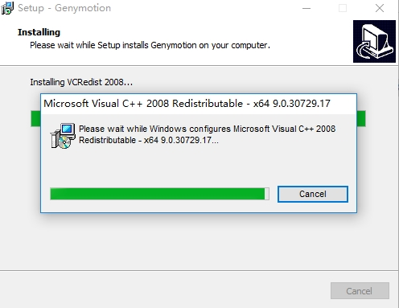
* 8.
* 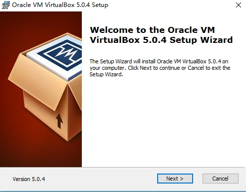
* 9.Oracle VM安装目录
* 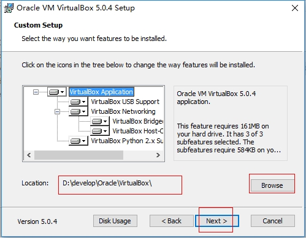
* 10.
* 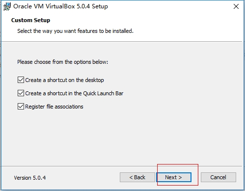
* 11.
* 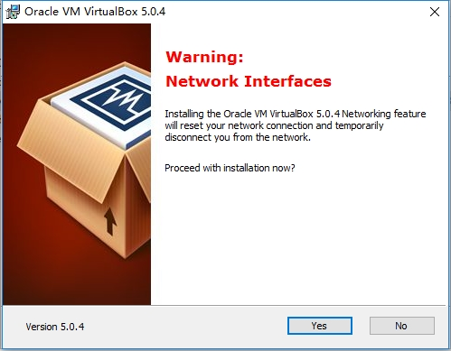
* 12.
* 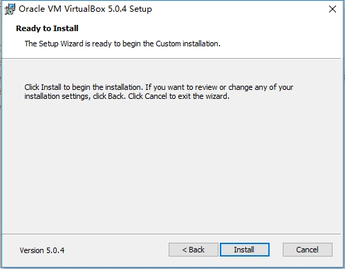
* 13.
* 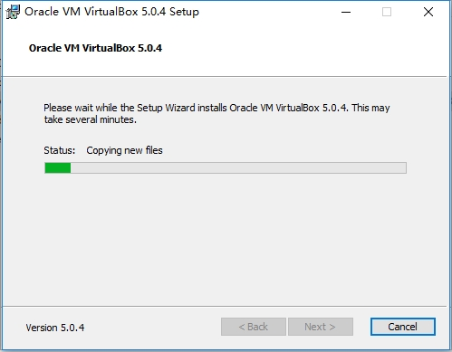
* 14.
* 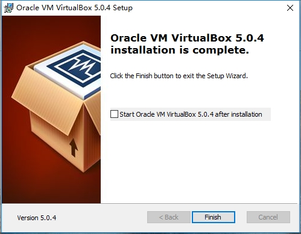
* 15.
* 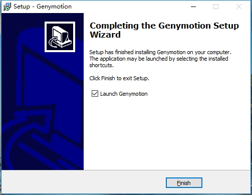
* 16.打开Genymotion
* 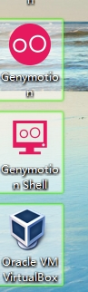
* 17.
* 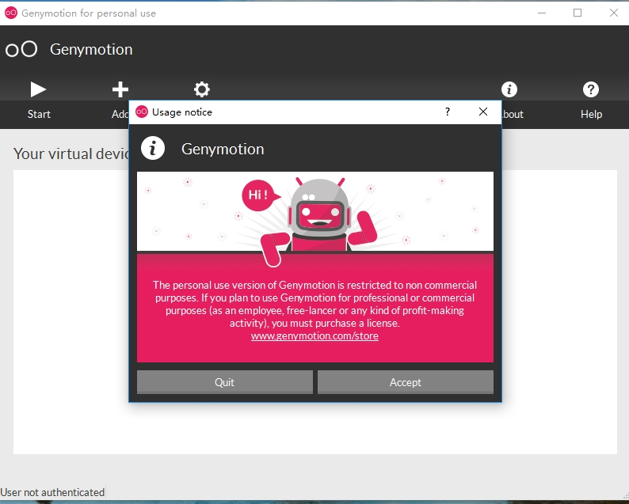
* 18.
* 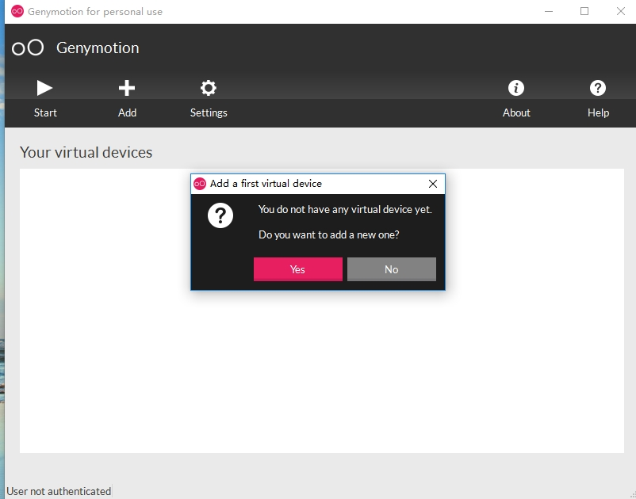
* 19.登录
* 
* 20.填写用户名和密码。在网页上下载genymoyion时，需要注册用户
* 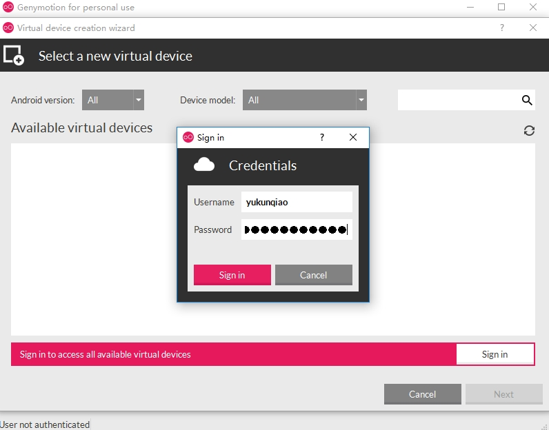
* 21.
* 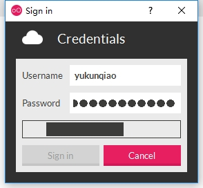
* 22.
* 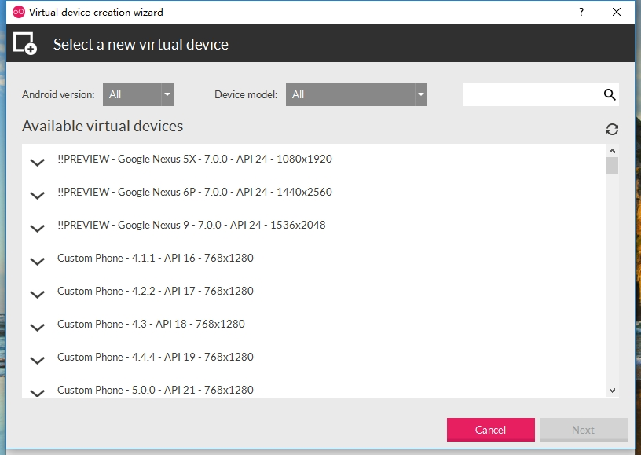
* 23.选择目录
* 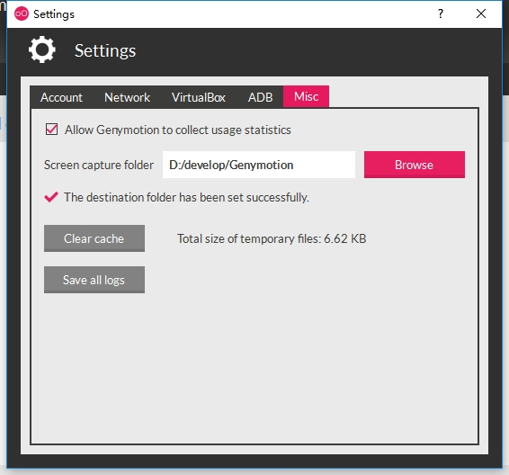
* 24.安装目录
* 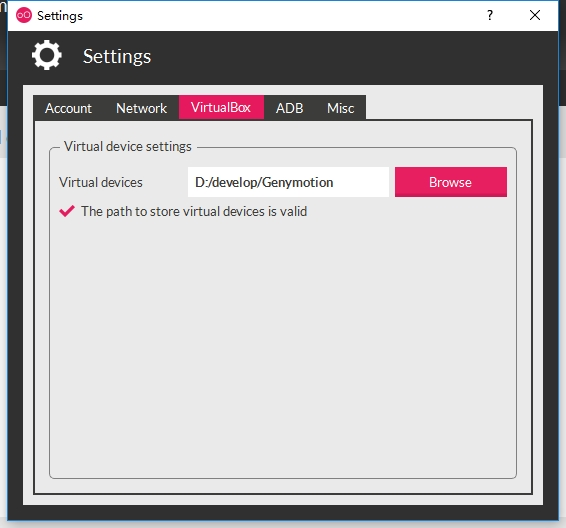
* 25.本地sdk目录
* 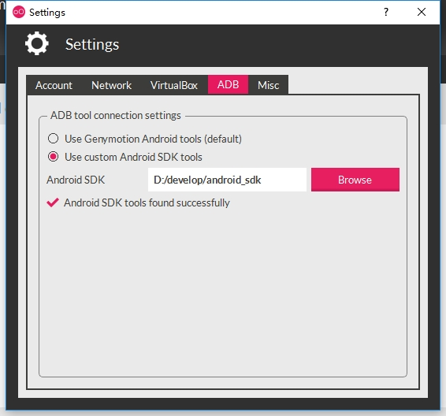